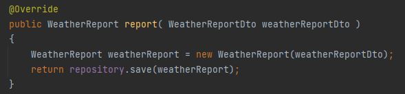

### Part 1: Verify that your test fail

In TDD you first implement the test then you write the code to achieve the test expected results.This time you will
start by runing existing test and then write the code to pass the test.

1. Download and sync the project in the repo.
2. Open the class *MongoWeatherServiceTest* and run the tests.

3. Read the results and check the code to find what is wrong.

### Part 2: Write to the code to pass the test

1. Implement the code so your tests pass.

##### Report

##### findById

2. Run your test again and verify that they all pass.

### Part 3: Implementing  Unit Tests for MongoWeatherService

1. Write 1 unit test for each method of the *WeatherService* to verify the correct implementation on the *
   MongoWeatherService*.

##### Test ReportNearLocation

##### Metodo ReportNearLocation

##### Test findWeaterReportByName

##### Metodo findWeaterReportByName

##### Correctos

### Part 4: Testing your Rest Controller

1. Open the *HealthControllerTest* class and run the tests.

2. Check the code and understand how to use the Spring Boot testing annotation.
3. Create a new class to test the *WeatherReportController* called *WeatherReportControllerTest*.
4. Copy the configuration annotations you will need from the *HealthControllerTest* class.

5. Implement 1 unit test for each method inside the *WeatherReportController*.

##### createTest

##### findByIdTest

##### findByReportsIdTest

##### findByReportsNameTest

##### Correctos

